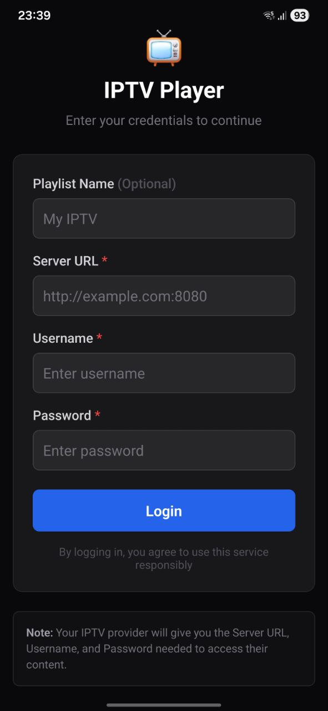
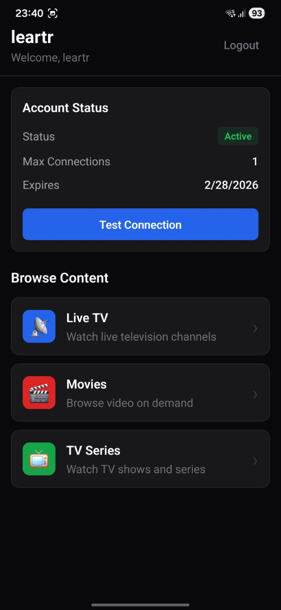
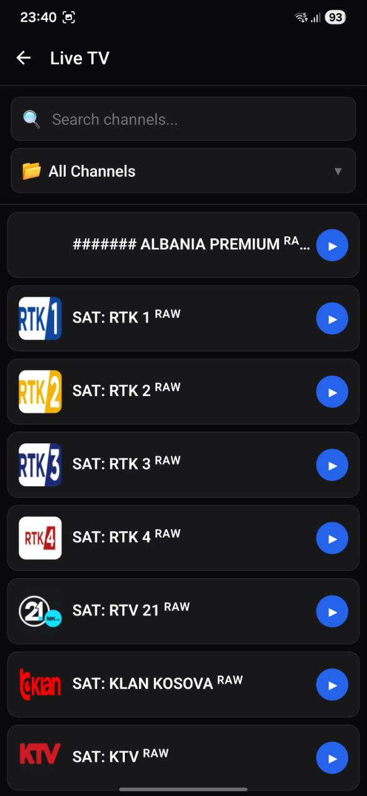
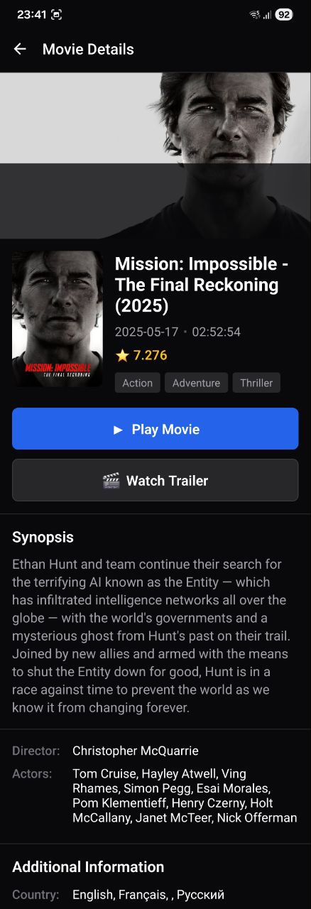
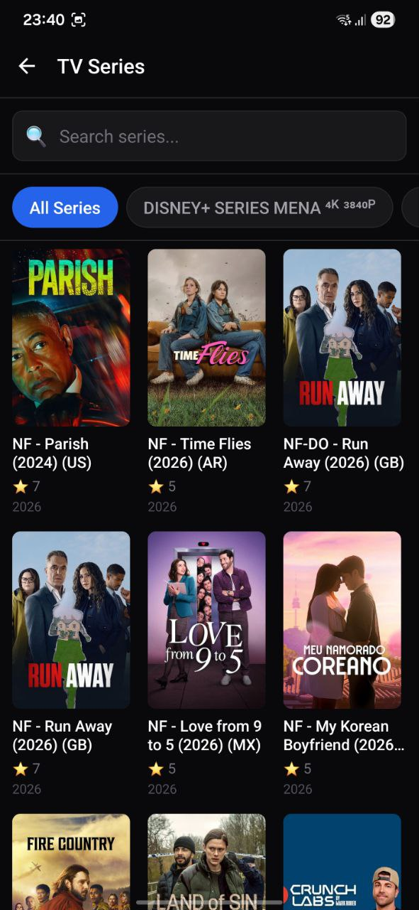
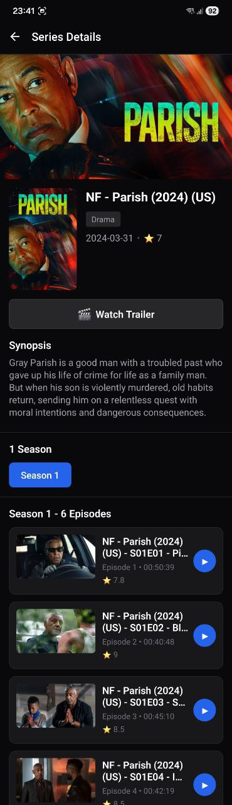

# IPTV Player App

## 📺 Overview

This IPTV Player App is a modern, lightweight, and user-friendly application designed to stream IPTV content using **Xtream Codes**  formats. It focuses on performance, simplicity, and a clean user interface, making it suitable for everyday IPTV usage across Live TV, Movies, and Series.

> ⚠️ **Important Notice**: This application **does not provide any IPTV content**. Users must supply their own legally obtained IPTV credentials or playlists.

---

## ✨ Key Features

* ✅ **Xtream Codes Support**
  Login using server URL, username, and password

* 📡 **Live TV Streaming**
  Watch live television channels with fast loading and smooth playback

* 🎬 **Movies on Demand (VOD)**
  Browse and stream movies with metadata and poster support

* 📺 **TV Series**
  Organized seasons and episodes for an easy binge‑watching experience

* 🎨 **Modern & Clean UI**
  Minimal, intuitive design focused on usability and speed

* ⚡ **Fast & Optimized Performance**
  Built for modern devices with efficient streaming handling

---

## 🧩 Supported Formats

| Format           | Description                                        |
| ---------------- | -------------------------------------------------- |
| Xtream Codes API | Full IPTV management with Live TV, Movies & Series |

---

## 🖼️ App Screenshots

> 
> 
> 
> 
> 
> 
> 

---

## 🔒 Legal Disclaimer

This IPTV Player App is **only a media player**.

* It does **not host**, **provide**, or **sell** any IPTV content
* It does **not include preloaded channels or playlists**
* Users are fully responsible for the content they access

Please ensure you have the legal right to stream any content used with this application.

---

## 🚀 Use Cases

* Personal IPTV streaming
* IPTV service clients
* Testing IPTV playlists
* Clean alternative to bloated IPTV players

---

## 📌 Summary

The IPTV Player App delivers a **simple yet powerful IPTV experience** by supporting the most popular IPTV formats while maintaining a modern and clean design. It gives users full control over their own content without enforcing or providing any media itself.

---

**© IPTV Player App – Media Player Only**
